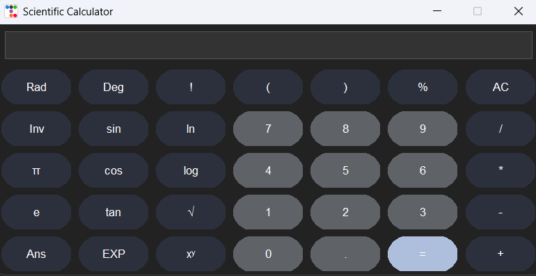

# Scientific Calculator 🧮✨

A sleek, modern, and powerful **Scientific Calculator** built with Python, Tkinter, and [ttkbootstrap](https://github.com/israel-dryer/ttkbootstrap).  
This UI is inspired by Google Scientific Calculator

---

## Features

- 📐 Full scientific calculations including:
  - Trigonometric functions: `sin()`, `cos()`, `tan()`  
  - Logarithmic and exponential: `ln()`, `log()`, `EXP`, `e`
  - Square root, powers (`√`, `xʸ`)  
  - Factorials (`!`) with postfix notation  
  - Constants: π (pi) and e  
  - Percentages (%)  
- ⌨️ Input via interactive clickable buttons  
- 💡 **Smart AC/CE button**: Acts as **Backspace (CE)** during input, and switches to **All Clear (AC)** after evaluation.
---

## Screenshot

---

